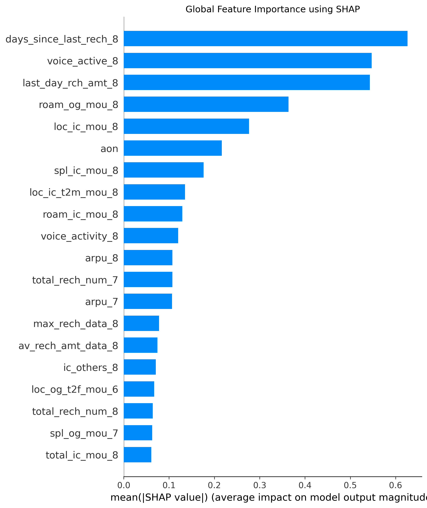
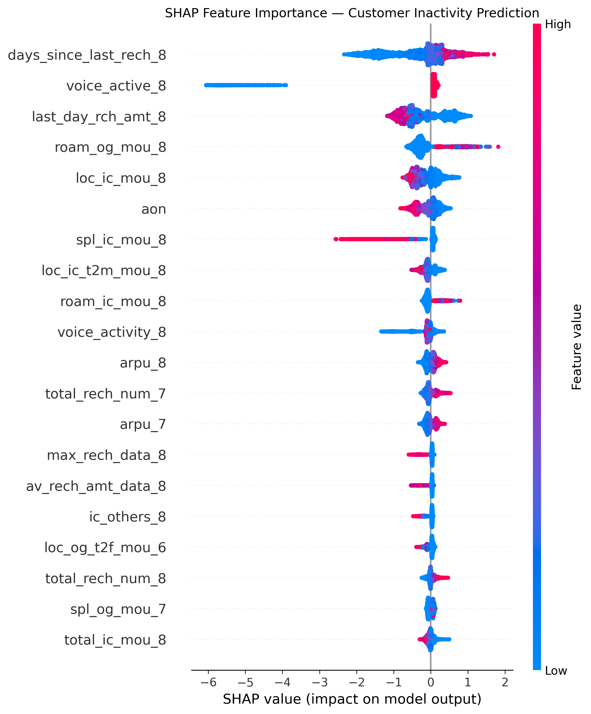

# Telecom Customer Inactivity Prediction

## Overview

This project focuses on predicting customer inactivity in a telecom dataset using machine learning.

The system analyzes customer usage, recharge, voice, data, roaming, and account-related behaviour to estimate the probability that a customer will become inactive. The predicted probability is then used to assign customers to different risk levels.

The project combines:

* Data preprocessing and feature engineering
* Imbalanced binary classification
* XGBoost model development
* Model evaluation and threshold optimization
* Customer-level risk scoring
* Risk-level segmentation
* SHAP-based model explainability
* Customer behaviour analysis

---

## Problem Statement

Customer inactivity can result in revenue loss and reduced customer retention for telecom service providers.

The objective of this project is to develop a machine learning system that can:

1. Identify patterns associated with customer inactivity.
2. Predict the probability of inactivity for individual customers.
3. Classify customers according to their predicted risk.
4. Identify the features that have the greatest influence on predictions.
5. Provide interpretable explanations for individual customer predictions.

---

## Machine Learning Pipeline

The overall workflow is:

Raw Telecom Customer Data
↓
Data Preprocessing
↓
Feature Selection and Preparation
↓
Training / Validation / Testing
↓
XGBoost Model Training
↓
Model Evaluation
↓
Threshold Optimization
↓
Customer Risk Prediction
↓
Risk Segmentation
↓
SHAP Explainability
↓
Risk and Behaviour Analysis

---

## Model Development

Several XGBoost configurations were evaluated using ROC-AUC and PR-AUC.

| Model | n_estimators | max_depth | learning_rate | PR-AUC | ROC-AUC |
| ----- | -----------: | --------: | ------------: | -----: | ------: |
| XGB_1 |          400 |         5 |          0.05 | 0.3715 |  0.9062 |
| XGB_2 |          600 |         4 |          0.05 | 0.3687 |  0.9085 |
| XGB_3 |          500 |         6 |          0.05 | 0.3650 |  0.9027 |
| XGB_4 |          500 |         5 |          0.03 | 0.3718 |  0.9089 |

The final model configuration used:

* `n_estimators = 500`
* `max_depth = 5`
* `learning_rate = 0.03`
* `subsample = 0.8`
* `colsample_bytree = 0.8`
* `objective = binary:logistic`
* `eval_metric = aucpr`
* `random_state = 42`

The final XGBoost model was subsequently trained on all 99,999 customers for generating customer-level risk predictions.

---

## Model Evaluation

The final model achieved the following evaluation results:

| Metric  |  Score |
| ------- | -----: |
| ROC-AUC | 0.9089 |
| PR-AUC  | 0.3718 |

Because the target variable is imbalanced, PR-AUC and class-specific precision, recall, and F1-score were considered alongside ROC-AUC and accuracy.

### Threshold Optimization

The classification threshold was optimized using F1-score.

The selected threshold was:

**0.81**

At this threshold:

| Metric    |  Score |
| --------- | -----: |
| Precision | 0.3772 |
| Recall    | 0.4768 |
| F1-score  | 0.4212 |
| Accuracy  | 0.9476 |

### Confusion Matrix

```text
[[18572   629]
 [  418   381]]
```

### Classification Report

```text
              precision    recall  f1-score   support

0                0.9780    0.9672    0.9726     19201
1                0.3772    0.4768    0.4212       799
```

---

## Customer Risk Scoring

The final model generates an inactivity probability for each customer.

Based on the probability, customers are assigned to four risk categories:

* Low
* Medium
* High
* Very High

For the complete set of 99,999 customers, the predicted risk distribution was:

| Risk Level |  Customers |
| ---------- | ---------: |
| Low        |     77,099 |
| Medium     |     11,393 |
| High       |      5,875 |
| Very High  |      5,632 |
| **Total**  | **99,999** |

The distribution of predicted probabilities is available in the project analysis outputs.

---

## Risk Group Analysis

The model predictions were further analyzed against the observed inactivity labels.

| Risk Level | Customers | Inactive Customers | Inactivity Rate |
| ---------- | --------: | -----------------: | --------------: |
| Low        |    77,099 |              3,091 |           4.01% |
| Medium     |    11,393 |                461 |           4.05% |
| High       |     5,875 |                231 |           3.93% |
| Very High  |     5,632 |                212 |           3.76% |

The mean predicted inactivity probability for each risk group was:

| Risk Level | Mean Predicted Probability |
| ---------- | -------------------------: |
| Low        |                     0.0525 |
| Medium     |                     0.3240 |
| High       |                     0.6466 |
| Very High  |                     0.8917 |

These results are provided as an analysis of the model's predictions and the observed labels in the available dataset.

---

## Important Features

The XGBoost model identified several features with high predictive importance.

The top features based on model feature importance included:

| Rank | Feature                  |
| ---: | ------------------------ |
|    1 | `voice_active_8`         |
|    2 | `roam_og_mou_8`          |
|    3 | `last_day_rch_amt_8`     |
|    4 | `loc_ic_mou_8`           |
|    5 | `days_since_last_rech_8` |
|    6 | `voice_activity_8`       |
|    7 | `spl_ic_mou_8`           |
|    8 | `total_rech_num_7`       |
|    9 | `loc_ic_t2m_mou_8`       |
|   10 | `roam_ic_mou_8`          |

Other important features included:

* `aon`
* `total_rech_num_6`
* `loc_ic_mou_6`
* `max_rech_data_8`
* `std_og_mou_7`
* `av_rech_amt_data_8`
* `total_ic_mou_8`
* `loc_ic_t2f_mou_8`
* `count_rech_3g_7`

---

## Model Explainability with SHAP

SHAP (SHapley Additive exPlanations) was used to understand how individual features contribute to the model's predictions.

A SHAP sample containing 5,000 observations and 175 features was used for the explainability analysis.

The top features according to mean absolute SHAP value were:

| Rank | Feature                  | Mean Absolute SHAP |
| ---: | ------------------------ | -----------------: |
|    1 | `days_since_last_rech_8` |             0.6264 |
|    2 | `voice_active_8`         |             0.5472 |
|    3 | `last_day_rch_amt_8`     |             0.5430 |
|    4 | `roam_og_mou_8`          |             0.3638 |
|    5 | `loc_ic_mou_8`           |             0.2767 |
|    6 | `aon`                    |             0.2166 |
|    7 | `spl_ic_mou_8`           |             0.1762 |
|    8 | `loc_ic_t2m_mou_8`       |             0.1352 |
|    9 | `roam_ic_mou_8`          |             0.1292 |
|   10 | `voice_activity_8`       |             0.1200 |

SHAP analysis was used at both:

* **Global level** — to understand overall feature influence.
* **Individual level** — to explain the prediction for a particular customer.

---

## Example Customer Explanation

An individual SHAP explanation was generated for customer:

`7000040799`

The model produced:

* Risk probability: `0.99256355`
* Risk level: `Very High`

The individual SHAP explanation identified the features contributing positively and negatively to this particular prediction.

The corresponding visualization is available in:

`figures/shap_customer_7000040799.png`

---

## Visualizations

### SHAP Global Feature Importance



### SHAP Summary Plot



### Individual Customer SHAP Explanation


---

## Repository Structure

```text
.
├── notebooks/
│   └── 01_data_preprocessing.ipynb
│
├── results/
│   ├── shap_feature_importance.csv
│   ├── model_metrics.json
│   ├── risk_group_summary.csv
│   └── low_vs_very_high_comparison.csv
│
├── figures/
│   ├── shap_global_importance.png
│   ├── shap_summary.png
│   └── shap_customer_7000040799.png
│
├── requirements.txt
├── .gitignore
└── README.md
```

Additional notebooks, source code, and project components can be added as the remaining stages of the project are integrated.

---

## Technologies Used

* Python
* Pandas
* NumPy
* Scikit-learn
* XGBoost
* SHAP
* Matplotlib
* Seaborn
* SciPy
* Joblib
* Jupyter Notebook
* Google Colab

---

## Installation

Clone the repository and install the required dependencies:

```bash
git clone <repository-url>
cd <repository-name>
pip install -r requirements.txt
```

---

## Reproducibility

The preprocessing notebook is available under:

```text
notebooks/01_data_preprocessing.ipynb
```

The repository also contains selected model results, SHAP analysis outputs, and visualization files under the `results/` and `figures/` directories.

Raw datasets and trained model binaries are excluded from the public repository where appropriate.

---

## Project Outputs

The completed ML pipeline produces:

* Customer inactivity probabilities
* Binary inactivity predictions
* Customer risk levels
* Risk group summaries
* Model evaluation metrics
* SHAP feature importance
* Global SHAP visualizations
* Individual customer explanations
* Comparative risk-group analysis

---

## Team Contributions

### Person 1

* Data preprocessing
* Feature preparation
* XGBoost model development
* Model comparison
* Model evaluation
* Threshold optimization
* Customer risk scoring
* SHAP explainability
* Risk-group analysis

### Person 2

* To be added

### Person 3

* To be added

---

## Limitations

The model outputs represent machine learning predictions based on the available customer data. A predicted inactivity probability should therefore be interpreted as a risk indicator rather than a guaranteed customer outcome.

The current repository represents the completed modelling and explainability work, while additional project components can be integrated as development continues.

---

## License

This project is developed for academic and educational purposes.
